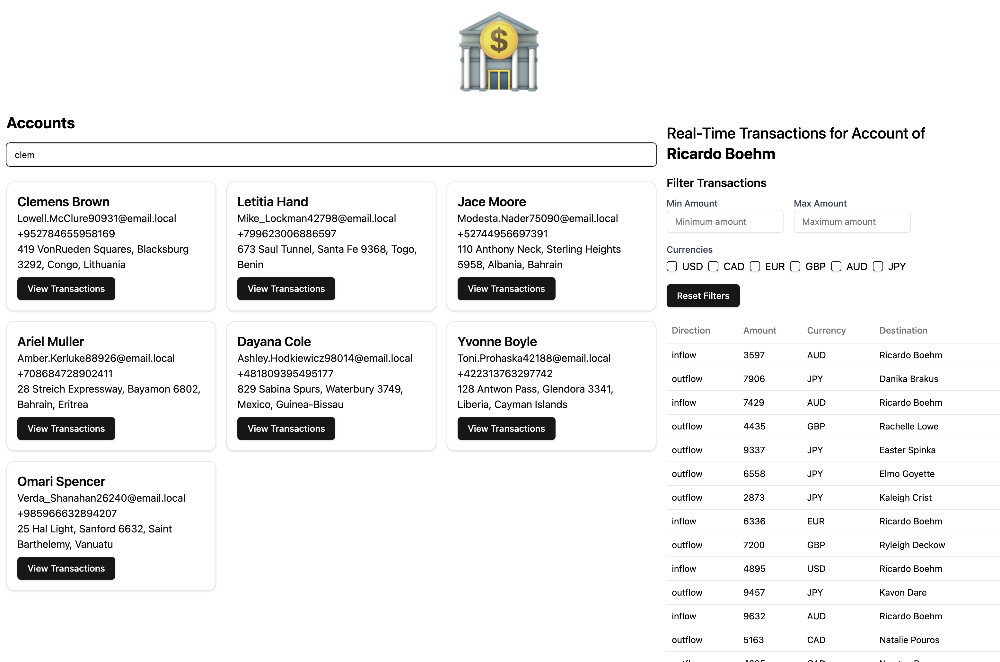

<p align="center"></p>

# paloma interview task

Author: Ricardo Fabila

## 🏃‍♂️ How to Run the Project Locally

To run the project locally, follow these steps:

1. Clone the project repository.
2. Install deps via `npm install`
3. create a `.env` file based of the `.env.example` file
4. run `npm run dev`

## ⚙️ Implementation details

This project uses a number of technologies for the front-end:

- shaCDN for the UI component system
- axios for API requests
- vite for bundling the app
- tailwind for css utilities
- reactjs
- typescript

The following is the directories pattern for the source as well as a brief explanation of what each one does:

```bash
├── 📂 src - contains the app source code
├── 📂 api - the api interceptor to make request
├── 📂 components - UI components to be reused accross the app
├── 📂 context - state management providers
├── 📂 lib - some miscellaneus utils
├── main.tsx - react app entry point
├── 📂 pages - the components that are entire screens of the app
├── 📂 services - code to be reused across the app for similar tasks
├── 📂 types - shared types to be used across the app
```